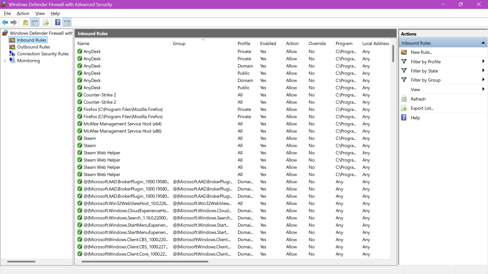
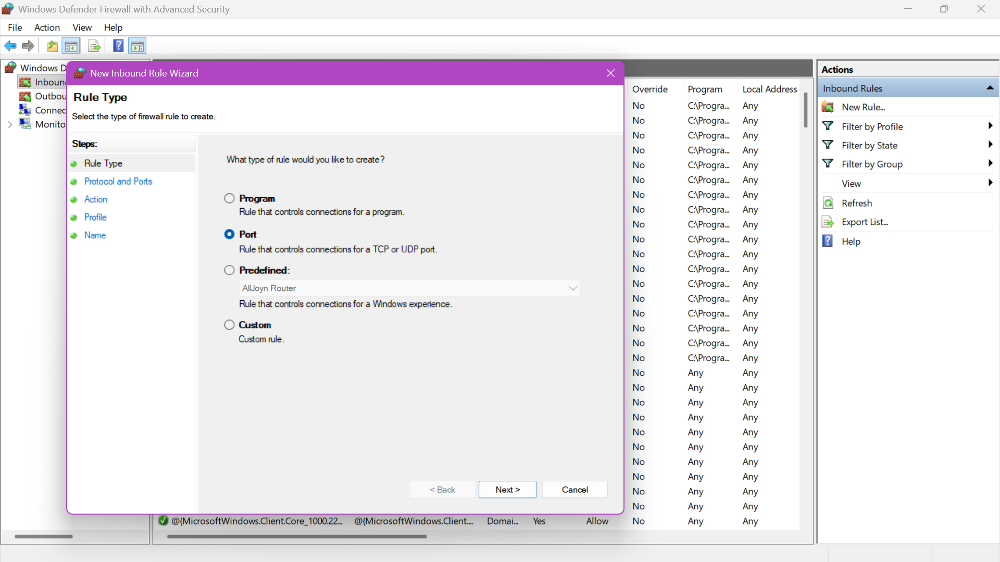
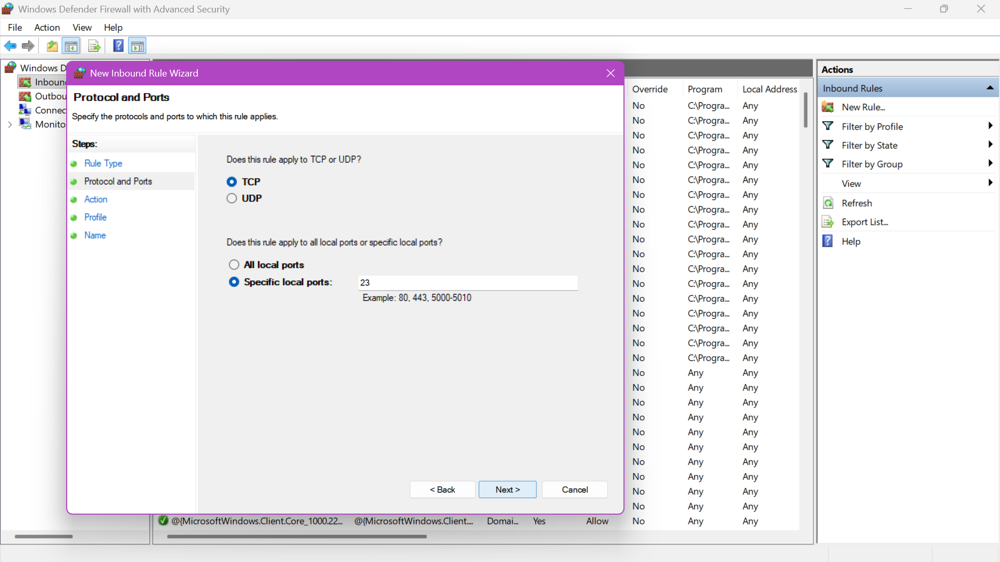
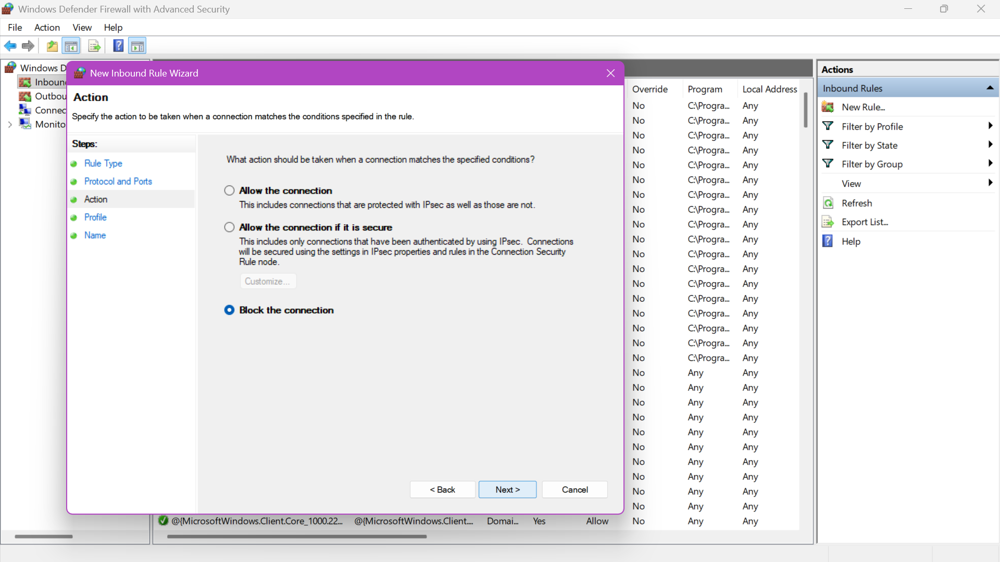
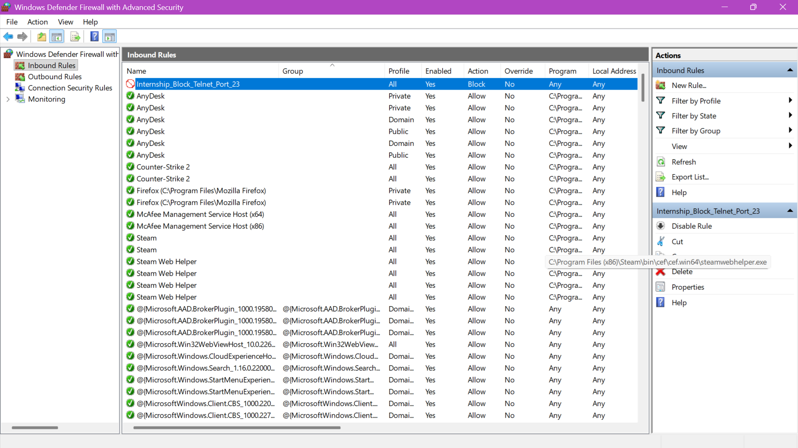
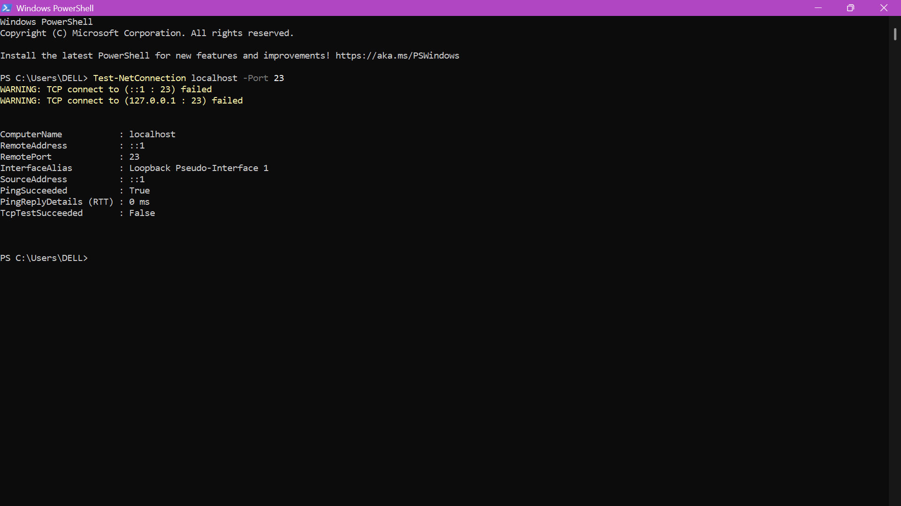

# Elevatelabs-task4-Firewall-Configuration
A practical demonstration of deploying custom inbound firewall rules to manage network security boundaries.

## 📌 Project Overview
- **Objective:** Configure, apply, and systematically test basic inbound firewall filtering rules to block or allow network traffic based on distinct protocols and ports.
- **Environment:** Windows 11 Home/Pro
- **Core Security Utility:** Windows Defender Firewall with Advanced Security
- **Verification Toolkit:** Windows PowerShell (`Test-NetConnection` utility)

---

## 🛠️ Step-by-Step Implementation & Documentation

### Step 1: Initialize the Firewall Management Console
The Windows Defender Firewall with Advanced Security snap-in was launched by executing `wf.msc` via the Windows Run dialog. This console provides the granular interface required to establish custom administrative network access control lists (ACLs).

* **System Baseline:** Navigated directly to the **Inbound Rules** engine on the left-hand menu tree to review active rules.


*Figure 1: Initial state of the Windows Defender Firewall Inbound Rules dashboard.*

---

### Step 2: Establish a New Custom Inbound Rule
To isolate specific port parameters, a new rule creation process was initialized by selecting **New Rule...** from the right-hand **Actions** pane. 

* **Rule Type Definition:** The rule parameters were explicitly focused on filtering network hardware configurations rather than individual software applications. Therefore, the **Port** rule type was toggled.


*Figure 2: Custom Inbound Rule Wizard specializing in TCP/UDP port filtering.*

---

### Step 3: Define Protocol and Specific Vulnerable Target Port
Following compliance guidelines, the firewall rule was configured to match target criteria precisely:
* **Transport Layer Protocol:** Transmission Control Protocol (**TCP**).
* **Target Interface Boundary:** Configured for a **Specific local port**, assigning it strictly to **Port 23** (the default channel for unencrypted Telnet connectivity).


*Figure 3: Mapping the Inbound Rule constraint strictly to TCP Port 23.*

---

### Step 4: Configure the Security Filtering Action
The firewall engine requires an explicit instruction when a packet matches the port criteria defined in Step 3. To meet the core task criteria of blocking inbound traffic, the action was set to **Block the connection**. This configuration overrides allow rules and forces the network stack to drop incoming matching packets immediately.


*Figure 4: Enforcing a drop action rule for all matching incoming traffic profiles.*

---

### Step 5: Name and Commit the Rule to the Active Matrix
The rule was deployed across all logical domain profiles (Domain, Private, and Public). It was saved under a clear administrative namespace: `Internship_Block_Telnet_Port_23`.

* **Validation View:** As shown below, the rule was committed successfully to the active security matrix, highlighted at the top of the ACL with a distinct red block icon.


*Figure 5: Newly deployed 'Internship_Block_Telnet_Port_23' rule committed to the operational engine.*

---

## 🛡️ Empiric Security Verification Testing

To evaluate the active state and efficacy of the rule, a local terminal connection probe was executed using advanced network diagnostics inside Windows PowerShell. The `Test-NetConnection` cmdlet was pointed directly at the local loopback adapter (`localhost`) over the blocked service port (`23`):

```powershell
Test-NetConnection localhost -Port 23
```
## Analysis of Diagnostic Output

Network Interface Integrity: PingSucceeded : True confirms that the local host's basic IP loopback routing function is completely operational and responding to standard ICMP traffic.

Firewall Drop Confirmation: The system issued explicit connection warnings: WARNING: TCP connect to (127.0.0.1 : 23) failed.

Core Result Metric: TcpTestSucceeded : False provides definitive empirical validation that our deployed firewall rule intercepted the TCP handshake attempt and dropped the packets cleanly before they could interface with the OS.


*Figure 6: Terminal trace displaying successful, active packet filtering on Port 23.


## 📊 Outcome & Traffic Filtering Summary

Through the successful execution of this task, foundational competencies in host-based firewall administration and access control management were verified.

How Firewalls Filter Traffic:-
A firewall functions as a network security gateway operating at the interface boundary of the operating system's kernel stack. Traffic filtering operates via an ordered sequential evaluation of network packet headers against the Access Control List (ACL):

Header Inspection: As a data unit arrives, the filtering engine reads structural packet properties, including Source IP Address, Destination IP Address, Transport Protocol (TCP/UDP), and Destination Port.

Policy Enforcement: If a packet's metadata matches an established rule criteria, the engine enforces its mapped action. In this project's scenario, when a socket request target matched TCP Port 23, the firewall executed an internal block policy. The system quietly discarded (dropped) the traffic, cutting off potential network discovery or remote exploit footprints from interacting with core OS applications.
